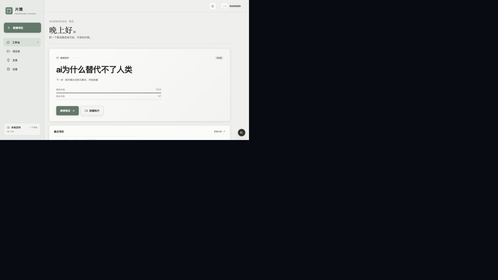
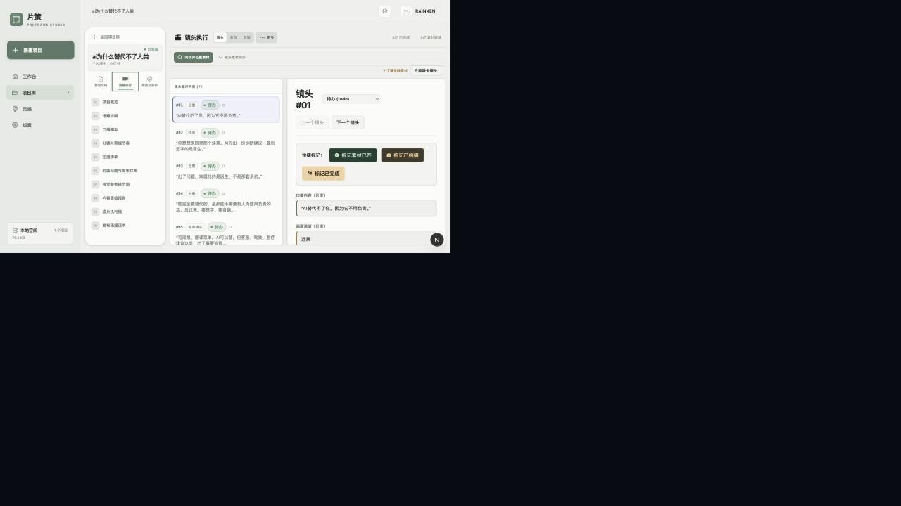
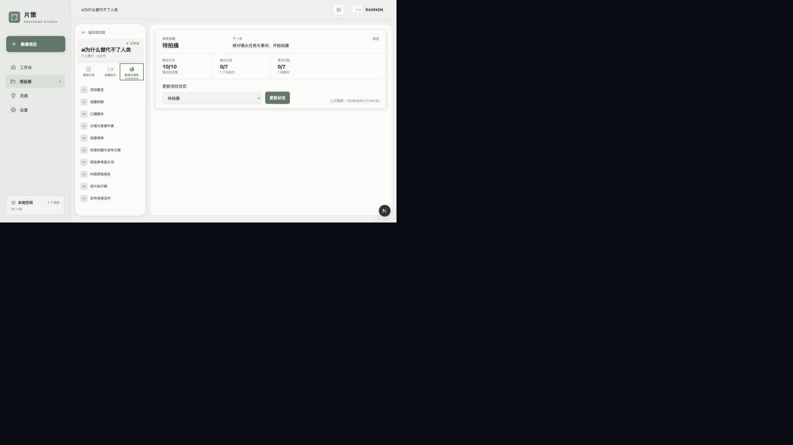
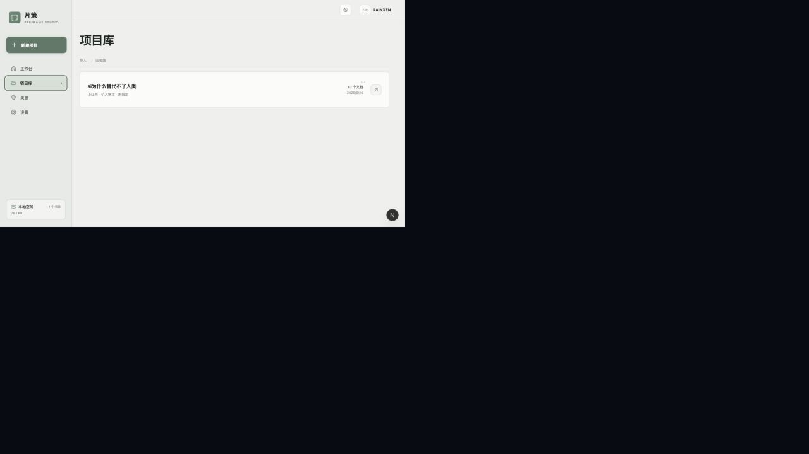

# Preframe 实质功能缺口审计

审计日期：2026-08-28

## 审计范围

- 当前本地代码与实际运行页面。
- 一条真实项目流程：工作台 → 项目文档 → 拍摄执行 → 剪辑准备 → 阶段 → 项目库。
- 当前数据：1 个活跃项目，10/10 文档，7 个镜头，0 个确认素材。
- 工程验证：`npm test` 全部通过，`npm run build:web` 成功。

## 总体判断

工作台确实没有必要继续扩展成管理后台。当前真正的问题是：Preframe 已经具备“生成、镜头任务、素材扫描、匹配、Proxy、剪辑目录、复盘和版本服务”，但用户完成一条内容时仍有三个关键断点：

1. 文档只能预览或交给 AI 改，不能直接编辑并保存。
2. 新建项目只有一个混合输入框，没有可追溯的事实/素材依据。
3. 镜头状态、拍摄 take、扫描到的素材和剪辑交付之间仍需要人工重复确认。

因此，下一阶段应补“完成作品所必需的闭环能力”，而不是补首页模块。

## 流程步骤与健康度

### 1. 工作台：首页摘要

健康度：可用，但价值重复。

- 优点：能给出一个明确的继续入口和拍摄执行入口。
- 风险：最近项目、文档进度和镜头进度都与项目库/项目页重复；“继续推进”只打开项目默认文档，不是上次现场。
- 建议：改为直接恢复最后上下文，或只保留一个极简继续入口。

### 2. 项目文档：核心内容工作区

健康度：核心缺口，且存在错误状态。

- 当前只能预览、复制、导出或输入 AI 修改指令，没有直接正文编辑。
- 已存在版本服务和版本面板组件，但版本面板没有接入页面。
- 页面同时显示正常正文和“当前失败文档”恢复卡，实际 `project.json` 中该文档状态为 completed。这是明确的渲染条件错误，不是功能设计问题。
- 建议：先修复恢复卡错误，再补直接编辑、自动保存、版本比较与回滚。

### 3. 拍摄执行：镜头与素材

健康度：数据基础扎实，现场使用仍不完整。

- 优点：镜头任务、状态、备注、缺素材、素材匹配和复盘已经在同一处。
- 风险：界面仍像桌面管理表，缺少现场真正会用的单镜头大字模式、提词、take 记录、好坏标记和快捷翻页。
- 另一个断点是“镜头状态”和“素材确认状态”并存但不是同一事实来源，容易出现镜头还是待办、素材却已就绪的矛盾。
- 建议：增加拍摄模式，并让确认素材自动推导镜头的 ready/shot 状态，保留用户手动覆盖。

### 4. 剪辑准备：文件与 Proxy

健康度：底层能力强，但交付停在目录层。

- 优点：已有 symlink、Proxy、失效检查、重连、工程文件发现和剪辑准备清单。
- 风险：当前最终交付只有 `EDIT_PLAN.json` 和 Markdown 清单，剪辑师仍需手工在 NLE 中建立镜头顺序、字幕和标记。
- 建议：先导出通用 CSV + SRT，再考虑 FCPXML；不要直接做自动剪辑。

### 5. 阶段页：项目状态

健康度：信息清楚，但状态需要人工维护。

- 优点：文档、镜头和素材三类完成度一眼可见。
- 风险：阶段是手动下拉更新；它没有从“镜头已拍完”“素材已匹配”“剪辑工作区已准备”自动得出建议状态。
- 建议：阶段保留人工最终决定，但系统应计算建议阶段并一键接受。

### 6. 项目库：浏览与管理

健康度：简洁可用。

- 当前只有 1 个活跃项目，因此全局搜索还没有成为真实瓶颈。
- 项目增长后再增加全文搜索是合理的，但搜索应直接定位到文档段落/镜头，而不是先做首页搜索框。

## 建议的功能优先级

### P0：直接编辑正文 + 自动保存 + 版本恢复

最小范围：

- 预览/编辑切换；
- Markdown 文本编辑；
- 600–1000ms 防抖自动保存；
- 保存前归档当前版本；
- 接入已有的版本比较和回滚；
- 仅当 03/04/05/09 文档改变时，同步重建派生镜头，并保留现有镜头状态和素材关系；
- 文件在磁盘被外部修改时提示冲突，不静默覆盖。

这是最应该先做的功能。一个创作工作台不能把“亲手改一句话”变成复制出去或再调用一次模型。

### P0：项目依据包（不是附件管理器）

新建项目时把当前“选题”拆成最少四类输入：

- 想表达的观点；
- 必须保留的事实/原话/产品信息；
- 已有草稿或素材文字；
- 禁止编造和不能触碰的边界。

第一版只支持粘贴文本即可，不做复杂文件管理。生成时要求每份文档引用这份依据，并在质检报告中指出哪些内容没有依据。这会比继续优化 Prompt 或加模型按钮更直接地提高可用性。

### P1：现场拍摄模式

- 一次只显示一个镜头；
- 大字号口播/提词；
- 上一镜/下一镜快捷键；
- 记录 take 数、最佳 take、废弃原因；
- 一键标记“已拍/补拍”；
- 自动保存，弱网/无网也可用。

这不是任务管理，而是把现有镜头数据变成现场工具。

### P1：素材回流自动化

- 打开应用或回到项目时自动扫描一次已配置目录；
- 新素材先匹配项目，再匹配镜头；
- 高置信度只给建议，不自动替用户选最佳 take；
- 素材确认后推导镜头状态和缺失数；
- 仅在新增、失效、歧义、缺失时提示。

当前扫描能力已经存在，但仍由请求参数 `scan=1` 或按钮触发，尚不是后台闭环。

### P1：剪辑软件可消费的交付

先做：

- 镜头 CSV；
- SRT 字幕草稿；
- 素材路径 + 镜头编号 + 建议入点/时长；
- 缺失素材报告。

后做：

- FCPXML；
- Premiere/Resolve 导入模板。

边界应保持为“准备好剪辑工程”，不越界做自动剪辑。

### P2：恢复上下文、全文搜索、命令面板

- “工作台=继续上次现场”应做，而且成本低；当前项目详情默认回到第一份文档，拍摄执行默认回到第一个镜头。
- 全文搜索在活跃项目达到约 10–20 个后价值明显；现在做不会验证核心闭环。
- `⌘K` 应建立在稳定动作和搜索索引之上，不应先于直接编辑与素材回流。

## 先修的明确问题

1. 正常文档错误显示“文档恢复/待处理”。
2. 已有 `DocumentVersionsPanel` 但未接入任何页面。
3. 首页“继续推进”不恢复文档、视图、镜头和滚动位置。
4. 素材扫描是显式触发，不是自动监听/定时扫描。
5. 阶段与镜头状态存在两套需要人工维护的状态来源。

## 可访问性与验证边界

- 页面大部分控件有可读标签，进度信息也同时使用文本，不只依赖颜色，这是好的基础。
- 需要进一步用键盘实测焦点顺序、弹窗焦点锁定、菜单关闭行为和小屏重排；截图不能证明完整可访问性。
- 本次没有真实视频素材，因此没有验证扫描、自动匹配、Proxy、重连和工程文件发现的完整交互状态。

